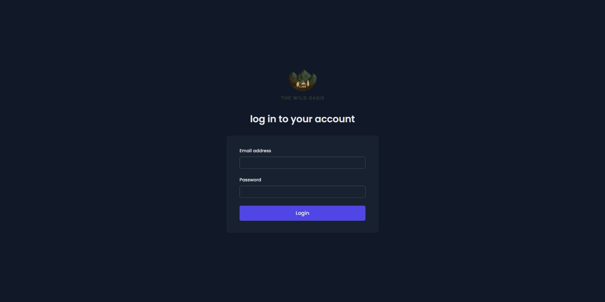
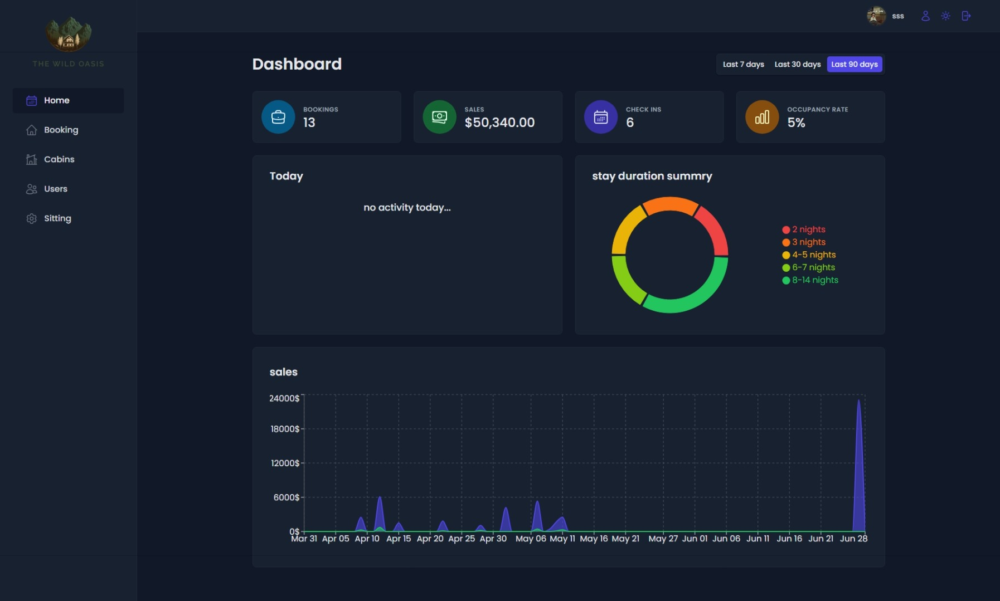
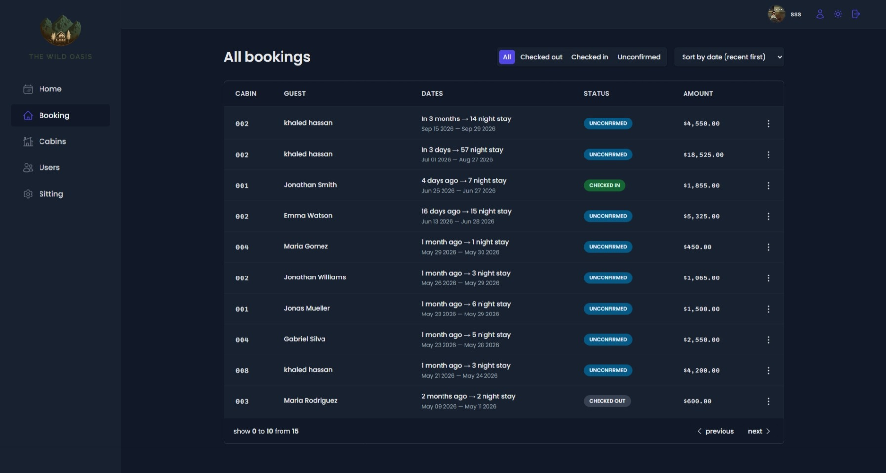
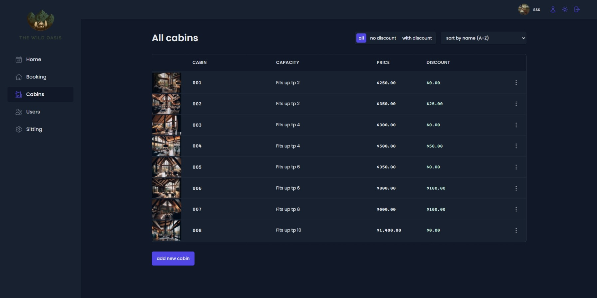
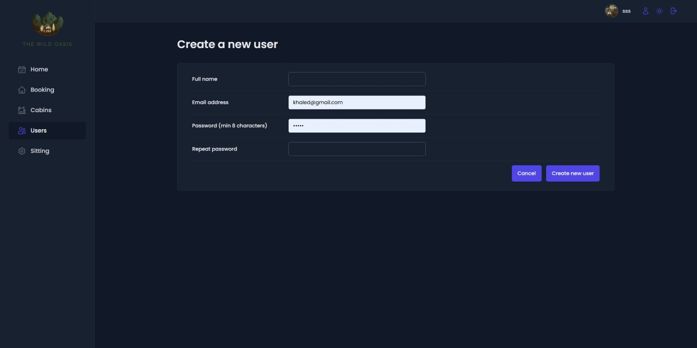
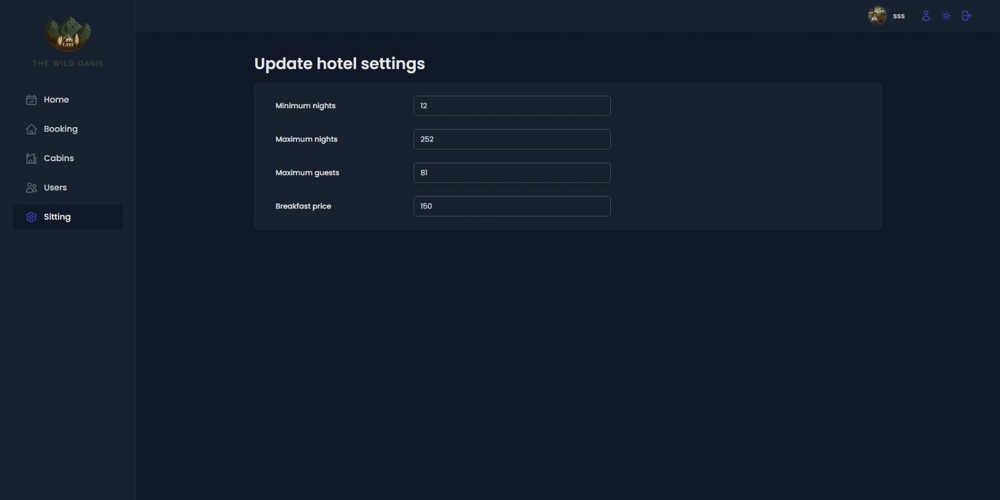
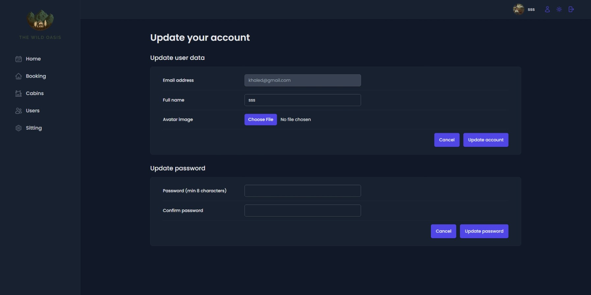

# 🏔️ The Wild Oasis (Admin Dashboard)

A full-featured admin management dashboard built for a luxury cabin hotel as part of an advanced training course. This application serves as a comprehensive capstone project to master remote state management and advanced React patterns, allowing hotel staff to manage cabins, bookings, guests, and settings efficiently with real-time data visualizations.---

## 📸 Guided Tour & Core Features

### 🔐 1. Authentication (Access Control)

- **Secure Entry:** Dedicated login system powered by Supabase Auth to ensure only registered hotel staff can access sensitive dashboard data.
- **State Management:** Handles persistent user sessions seamlessly without extra boilerplate.

### 📊 2. Main Dashboard & Analytics

- **Real-Time Analytics:** Tracks critical metrics including total bookings, dynamic sales computations, recent check-ins, and occupancy rate calculations over selectable periods (7, 30, or 90 days).
- **Advanced Visualizations:** Uses complex data structures to render interactive sales area charts and stay duration pie charts for intuitive business insights.

### 📅 3. Dynamic Booking Management

- **Server-Side Operations:** Fully optimized table supporting server-side filtering (All, Checked out, Checked in, Unconfirmed) and server-side sorting.
- **Pagination:** Built-in server-side pagination to ensure peak performance even with thousands of booking records.
- **Status Badges:** Dynamic UI indicators reflecting the real-time status of each guest's stay.

### 🛏️ 4. Cabin Inventory & Operations

- **Full CRUD Operations:** Staff can add, update, or delete cabins, including uploading cabin cover photos directly to secure Supabase Storage Buckets.
- **Data Actions:** Contextual action menus on each row allowing quick modifications or instant duplication of existing cabins to speed up inventory growth.

### 👥 5. Access Management & Staff Creation

- **Internal Sign-up Restrictions:** To maintain absolute security, new admin/staff accounts can only be provisioned internally by an authenticated user via this structured form.
- **Form Validation:** Strict client-side validation built on top of robust form handling strategies.

### ⚙️ 6. Global Hotel Settings

- **Dynamic Configurations:** Direct control over global business variables such as minimum/maximum night stays, maximum guest capacity, and customized breakfast pricing.
- **Optimistic Updates:** Changes are instantly synchronized with the PostgreSQL database, updating the global system state smoothly.

### 👤 7. User Profile & Account Maintenance

- **Profile Customization:** Allows active staff members to update their personal details, upload fresh avatar images, or securely update their access passwords.

---

## 🛠️ Tech Stack & Architecture

### Frontend Core

- **React (SPA):** Built as a high-performance Single Page Application using Vite.
- **React Router Dom:** Managed declarative client-side routing and navigation.
- **React Query (TanStack Query):** Highly efficient remote state management, caching, automatic re-fetching, and optimistic mutations.
- **React Hook Form:** Advanced form validation and management.

### Styling & UI

- **Styled Components:** Utilized for component-scoped, dynamic CSS styling allowing seamless dark/light theme integration.
- **React Icons:** Clean, modern iconography (Hi2) throughout the system.

### Backend & Storage

- **Supabase:** Used as a BaaS (Backend-as-a-Service) providing a PostgreSQL database, authentication, and secure bucket storage for cabin images.

### Design Patterns Applied

- **Compound Component Pattern:** Implemented masterfully to handle complex UI states implicitly (e.g., `<Menus>`, `<Modal>`, and `<Table>`), avoiding props drilling and keeping the JSX highly declarative.
